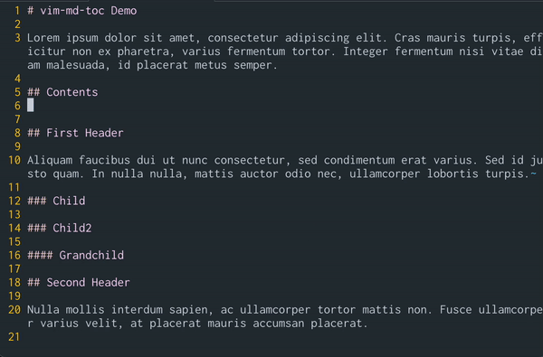

# Vim Markdown TOC Generator

[](https://github.com/drinkataco/vim-md-toc/actions?workflow=Vint)
[](https://github.com/drinkataco/vim-md-toc/actions?workflow=Vader)

Generate table of contents in your markdown files.

<!-- vim-md-toc format=bullets ignore=^TODO$ -->
* [Installation](#installation)
* [Usage](#usage)
  * [Commands](#commands)
  * [Configuration](#configuration)
* [Credits](#credits)
<!-- vim-md-toc END -->

## Installation

Install with your favourite plugin manager.

With [vim-plug](https://github.com/junegunn/vim-plug)

```Vimscript
Plug 'drinkataco/vim-md-toc'
```

## Usage



### Commands

* `:Toc`

   Generate Table of Contents

   **Arguments**

   `:Toc 5 ^Contents$`

   * The first argument is used to indicate the maximum depth of the contents children. By default, the value `g:mdtoc_max_level` is used.
   * The second argument is used to denote patterns of headers to ignore, and their children will also be ignored. A default pattern can be set with `g:mdtoc_ignore_regex`.

* `:TocNumbered`

   Generate Table of Contents, Numbered

   See `:Toc` for list of arguments

* `:TocDelete`

   Delete Table of Contents, if contents are fenced (see `g:mdtoc_fences`)

* `:TocUpdate`

   Update Table of Contents, if contents are fenced (see `g:mdtoc_fences`). Can be automated on all markdown files by setting `g:mdtoc_autoupdate` to `1`.

### Configuration

* `g:mdtoc_autoupdate`

   Default: `0`

   Enable to allow table of contents to be auto updated on save. Requires `g:mdtoc_fences` to be enabled.

* `g:mdtoc_fences`

   Default: `1`

   Whether to add fences to the generated table for contents (comments that indicate the ToC has been generated by this plugin). Fences are used to discover where the table of contents are for updating and deleting with the `:TocUpdate` and `:TocDelete` commands.

* `g:mdtoc_fence_style`

   Default: `xml`

   By default, as expected by most markdown parsers, fences are added in the style of xml/html comments; `<!-- vim-md-toc -->`. Setting this value to `js` allows the fences to be represented like `/* vim-md-toc */`.

* `g:mdtoc_ignore_regex`

  No Default

  Add common regex patterns for headers (and their children) to be ignored. For example, `^Contents$`

* `g:mdtoc_max_level`

   Default: `0` (unlimited)

   Set the default max child level of the table of contents.

## Credits

This plugin was developed out of [perservim/vim-markdown](https://github.com/preservim/vim-markdown) - based off of the Table of Contents functionality, and includes a bunch of new features and bug fixes.

## TODO

* Add command context
  * Add to nearest header
  * use max_level in inserted context
  * support multiple table of contents for update, delete
